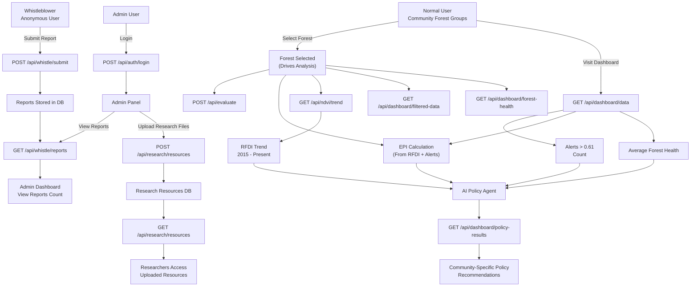

# Forest Tracker

Forest Tracker is a specialized web application for monitoring `forest degradation` in Makueni County, Kenya, using Sentinel-1 satellite radar data. The system uses the:

* `Radar Forest Degradation Index (RFDI)` feature to detect forest disturbances, with a threshold of 0.61 used to categorize areas as alerts-labelled 1 indicating potential logging, encroachment, or other degradation activities.
* `Environment perfomance index` KPI to enable policy recommendations. 
* `Average forest health` KPI to track the forest health relative to the forests in Makueni 

All these KPIs are used to recommend necessary policies for the selected forest. 

## Overview

Makueni County, located in a semi-arid region of Kenya, contains eight key forests that face significant threats from human encroachment, illegal logging, and agricultural expansion. These areas are often neglected in national conservation efforts due to their arid conditions and remote locations. Forest Tracker addresses this gap by providing real-time monitoring of forest health across these eight forests, enabling community organizations, associations, and policymakers to take timely action against degradation.

The application processes `Sentinel-1 satellite data` to compute RFDI values, tracks weekly trends from 2015 to date, number of alerts above the threshold for every forest which are used to generate AI-powered policy advocacy recommendations tailored to the specific challenges faced by Makueni's forest ecosystems to enable biodiversity which is one of the major factors in `Environment performance Indicator`. 

## Features

- *RFDI Analysis*: Processes Sentinel-1 satellite radar data (VV and VH polarizations) to compute the `Radar Forest Degradation Index (RFDI)`. Uses a threshold of 0.61 to identify forest degradation alerts, providing monthly and yearly trends to track disturbances over time(Yearly and monthly filters).
- *Forest Health Monitoring*: Tracks the health of eight individual forests in Makueni County (Chyulu, Katende, Kibwezi, Kilungu, Kivale, Makuli, Mavindu, Mulooni) relative to county-wide degradation levels, enabling targeted conservation efforts.
- *Policy Evaluation*: Generates AI-powered policy recommendations specifically tailored to Makueni's forests, addressing threats like illegal logging, agricultural encroachment, and ecosystem degradation in arid environments. 

The policy generated is dependent on:
* The average forest health
* Environment performance index
* Frequency of alerts

- **Whistleblower Reports**: Allows anonymous submission of forest encroachment reports for community-based monitoring of logging and land-use changes.
- **Dashboard**: Interactive dashboard displaying RFDI trends, forest health scores, degradation alerts, and unique policy evaluation and reccomendation results for each of the eight Makueni forests.
- **Authentication**: Secure login system with role-based access (researcher/admin) for protected resources and data analysis tools.
- **Research Resources**: Platform for managing and accessing conservation research materials focused on semi-arid forest ecosystems.

## Installation

### Prerequisites

- Python 3.8 or higher
- Node.js v14 or higher
- npm or yarn

### Backend Setup (Flask)

1. Create a virtual environment:
   ```bash
   python -m venv makueni
   ```

2. Activate the virtual environment:
   - On Windows: `makueni\Scripts\activate`
   - On macOS/Linux: `source makueni/bin/activate`

3. Install Python dependencies:
   ```bash
   pip install -r requirements.txt
   ```

4. Set up environment variables:
    Create a `.env` file in the root directory with:
    ```
    JWT_SECRET=your_secret_key_here
    GEMINI_API_KEY=your_google_gemini_api_key_here
    ```

### Frontend Setup (Express.js)

1. Install Node.js dependencies:
   ```bash
   npm install
   ```

2. Configure environment (optional):
   Create a `.env` file in the root directory with:
   ```
   PORT=3000
   FLASK_BACKEND_URL=http://localhost:5000
   ```

## API Endpoints

### Authentication
- `POST /api/auth/login` - User login

### Research
- `GET /api/research/resources` - Get research resources (authenticated)
- `POST /api/research/resources` - Add research resource (admin only)
- `POST /api/research/summarize_article` - Summarize web article (authenticated)

### Dashboard
- `GET /api/dashboard/data` - Get dashboard metrics
- `GET /api/dashboard/policy-results` - Get policy evaluation results
- `POST /api/dashboard/ndvi/predict` - Predict GDP from NDVI value

### Reports
- `POST /api/whistle/submit` - Submit anonymous report
- `GET /api/whistle/reports` - Get all reports (authenticated)

### Data Analysis
- `GET /api/ndvi/trend` - Get RFDI trend data for Sentinel-1 analysis
- `GET /api/dashboard/forest-health` - Get forest health scores based on RFDI alerts
- `GET /api/dashboard/filtered-data` - Get filtered Sentinel-1 data with RFDI alerts
- `GET /api/evaluate` - Run AI-powered policy evaluation for Makueni forests

## Workflow Diagram




## 🌿 Usage

1. **RFDI Monitoring**  
   The system processes Sentinel-1 satellite data to compute the Radar Forest Degradation Index (RFDI), detect degradation alerts above the **0.61 threshold**, and track long-term monthly trends across Makueni’s eight forests. This enables continuous monitoring of disturbance patterns over time.

2. **Forest Health & Environmental Performance Index (EPI)**  
   Each selected forest is evaluated using a combined **Forest Health Score** and **Environmental Performance Index (EPI)**.  
   These indices incorporate:
   - RFDI values  
   - Alert frequency and severity  
   - VH/VV backscatter ratios  
   - RVI (Radar Vegetation Index)  
   - Multi-year degradation trends  

   Together, they provide an objective measure of ecological health, enabling comparison across forests and identification of high-risk areas.

3. **Alert Trend Analysis**  
   Users can visualize the **monthly trend and total number of alerts exceeding the 0.61 threshold** for each forest.  
   This highlights:
   - Seasonal pressure cycles  
   - Unusual increases in forest stress  
   - Long-term encroachment or degradation patterns  

4. **Correlation & Impact Analysis**  
   The platform enables analysis of relationships between forest degradation and socio-economic indicators.  
   This helps quantify the broader impacts of forest health on:
   - Local livelihoods  
   - Water resources  
   - Agricultural productivity  
   - Environmental stability in semi-arid regions  

5. **AI-Powered Policy Evaluation**  
   An integrated AI agent combines EPI, forest health scores, RFDI trends, and alert counts to generate **forest-specific policy recommendations**.  
   These recommendations address regional challenges such as:
   - Illegal logging  
   - Charcoal production  
   - Agricultural encroachment  
   - Broader ecosystem degradation  

   This ensures policy advocacy is evidence-based and tailored to the selected forest.

6. **Community-Driven Monitoring**  
   Community members and forest associations can anonymously submit reports of forest encroachment or illegal activities.  
   These reports flow to the admin dashboard and serve as **ground-level validation**, enhancing monitoring accuracy in remote or semi-arid forest zones.

## Notes

- **Makueni County is used as the pilot area** because it is officially categorized as an **ASAL (Arid and Semi-Arid Lands) county**, making it highly vulnerable to drought stress, forest degradation, and climate-driven ecosystem changes. Its semi-arid conditions provide an ideal testing environment for evaluating forest health tools in water-scarce regions.

- The application focuses on **eight forests in Makueni County**: Chyulu, Katende, Kibwezi, Kilungu, Kivale, Makuli, Mavindu, and Mulooni — all of which face significant threats from logging, charcoal production, and agricultural encroachment in semi-arid environments.

- The **RFDI threshold of 0.61** is calibrated for Sentinel-1 radar data to detect forest degradation in arid and semi-arid ecosystems. Users may adjust this threshold depending on local vegetation structure and historical forest performance.

- The system currently uses **in-memory storage** for session data and generated resources. For production deployment, consider migrating to a persistent database such as **PostgreSQL, MongoDB, or Firebase**.

- Some **API endpoints require authentication**. Ensure correct JWT handling and proper configuration of environment variables such as `GEMINI_API_KEY`.

- A custom **forest background animation** enhances the user interface by visually reflecting the semi-arid ecosystems characteristic of Makueni County.

- Accurate results depend on **timely updates of Sentinel-1 satellite imagery**. Ensure that data sources are regularly refreshed to maintain reliability for real-time forest monitoring and alert generation.
